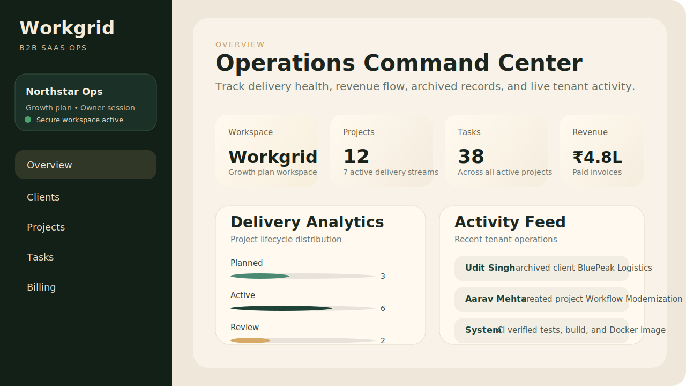
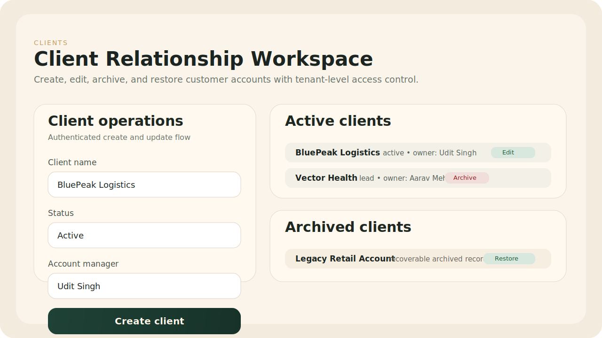
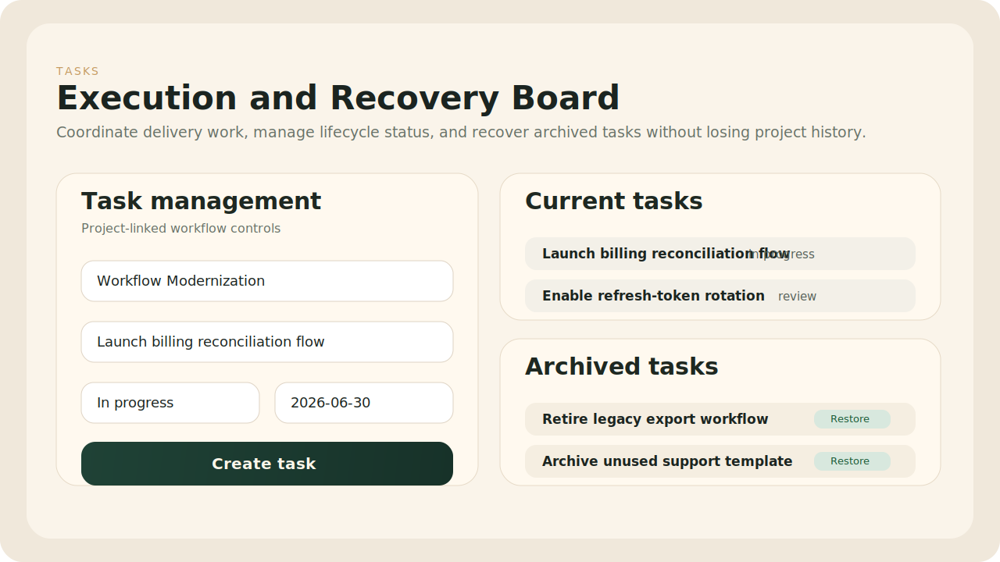
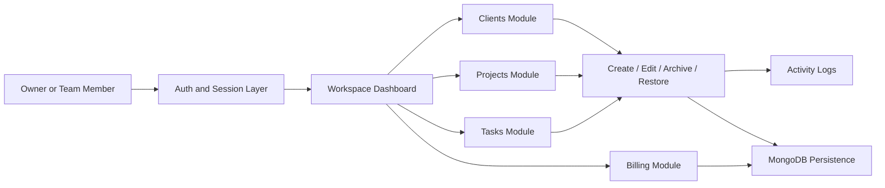
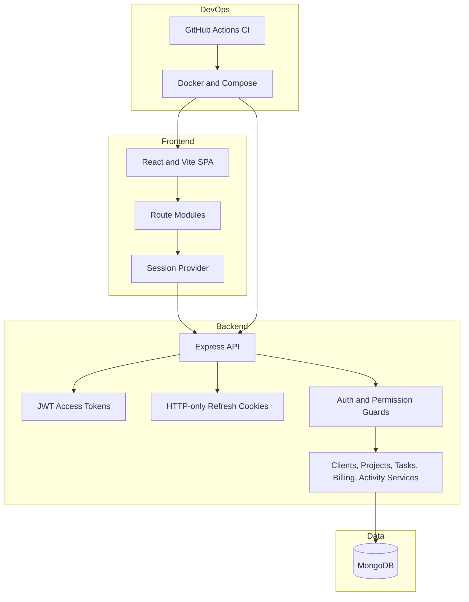
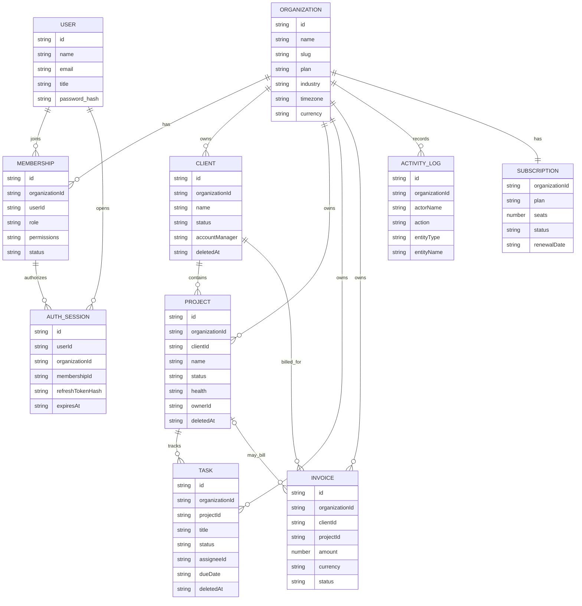

# Workgrid

Workgrid is a multi-tenant B2B SaaS operations platform for managing clients, projects, tasks, billing, team access, and workspace activity from a single admin console.

## Hero

Workgrid helps B2B teams run delivery operations with secure tenant isolation, role-aware access, soft-delete recovery, analytics dashboards, and production-style CI/CD foundations.

**Core value**

- Centralize client, project, task, billing, and activity operations in one workspace
- Enforce workspace-aware permissions and authenticated access across every major route
- Recover archived records safely with Mongo-backed soft delete and restore flows
- Demonstrate production-minded engineering with testing, Docker, and GitHub Actions CI

**Tech stack**

- Frontend: React, TypeScript, Vite, React Router
- Backend: Express, TypeScript, Zod, JWT auth, bcryptjs
- Database: MongoDB with Mongoose-backed persistence
- DevOps: Docker, Docker Compose, GitHub Actions, Vitest, Testing Library, Supertest

**Highlights**

- Multi-tenant onboarding with organization-scoped sessions
- Role and permission guards for workspace modules
- Clients, projects, tasks, billing, and activity management
- Refresh-token auth with HTTP-only cookie flow
- Analytics widgets and polished dashboard UI
- CI pipeline for tests, builds, and Docker verification

## Architecture Snapshot

```text
React + Vite frontend
        |
        v
Express API layer
        |
        v
Auth + permissions + validation
        |
        v
MongoDB persistence layer
```

## Quick Start

```bash
npm install
docker compose up mongo -d
npm run dev:api
npm run dev:web
```

Open:

- App: [http://localhost:5173](http://localhost:5173)
- API: [http://localhost:4000/api](http://localhost:4000/api)

## Product Screenshots

### Overview dashboard



### Client operations



### Task execution



## Product Flow Diagram



## System Design Diagram



## ER Diagram



## Current Product Scope

- Workspace onboarding and login
- Role-aware tenant dashboard
- Clients, projects, tasks, billing, and activity feeds
- Secure password hashing with `bcryptjs`
- Signed auth tokens with `jsonwebtoken`
- MongoDB persistence with required database startup
- MongoDB-only backend mode

## Security Measures

- Passwords are hashed before storage
- Authenticated routes require signed bearer tokens
- Tenant data is filtered by `organizationId`
- Sensitive API routes use centralized auth middleware
- Production mode can serve frontend and API from one origin

## Local Development

### 1. Install dependencies

```bash
npm install
```

### 2. Create API env

Copy `apps/api/.env.example` to `apps/api/.env` and set:

```env
PORT=4000
NODE_ENV=development
CLIENT_URL=http://localhost:5173
JWT_SECRET=replace-with-a-long-random-secret
JWT_EXPIRES_IN=7d
MONGODB_URI=mongodb://localhost:27017/workgrid
SERVE_STATIC_FRONTEND=false
```

### 3. Start MongoDB

If you have Docker installed:

```bash
docker compose up mongo -d
```

### 4. Start the app

```bash
npm run dev:api
npm run dev:web
```

Frontend:

- [http://localhost:5173](http://localhost:5173)

API:

- [http://localhost:4000/api](http://localhost:4000/api)

## GitHub Actions CI/CD

Workgrid includes a GitHub Actions workflow that runs on every push and pull request to:

- install dependencies with `npm ci`
- run API and web tests
- run the full production build
- validate the Docker image can be built successfully

Workflow file:

- `.github/workflows/workgrid-ci.yml`

## Docker Run

### Start the whole stack

```bash
docker compose up --build
```

Open:

- [http://localhost:4000](http://localhost:4000)

This runs:

- MongoDB in one container
- The app in one container
- The frontend served by Express in production mode

## Cloud Deployment Steps

### Option 1: Docker on AWS EC2 / DigitalOcean / Azure VM

1. Create a Linux VM
2. Install Docker and Docker Compose
3. Clone this project
4. Set production values in `docker-compose.yml` or an env file
5. Run:

```bash
docker compose up -d --build
```

6. Open port `4000` in the firewall or place Nginx in front
7. Point your domain to the VM IP

### Option 2: Render / Railway / Fly.io

1. Push this repo to GitHub
2. Create a new service from the repo
3. Use the root `Dockerfile`
4. Set environment variables:
   - `PORT=4000`
   - `NODE_ENV=production`
   - `JWT_SECRET=<long-random-secret>`
   - `JWT_EXPIRES_IN=7d`
   - `MONGODB_URI=<managed-mongodb-connection-string>`
   - `SERVE_STATIC_FRONTEND=true`
   - `CLIENT_URL=<your-app-url>`
5. Deploy

### Option 3: MongoDB Atlas + App Container

1. Create a MongoDB Atlas cluster
2. Create a database user
3. Add network access rules
4. Copy the Atlas connection string into `MONGODB_URI`
5. Deploy the Docker app to your cloud platform

## Production Notes

- Replace the default `JWT_SECRET`
- Use MongoDB Atlas or a secured private Mongo instance
- Put the app behind HTTPS in production
- Restrict MongoDB network access
- Add refresh tokens and HTTP-only cookies for stricter auth in the next phase
- Add rate limiting and request logging for public deployment

## Useful Commands

```bash
npm run build
npm run test
npm run test:api
npm run test:web
npm run start
docker compose up --build
docker compose down
```
